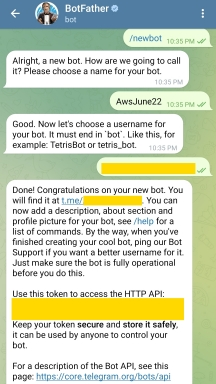

# Tying it all together

## Deploy the YouTube Telegram Bot App

### Create the EC2 instance 

1. Create an EC2 instance, as follows:
    1. **Ubuntu** AMI.
    2. **t2.micro** instance type (or equivalent micro type from another generation).
    3. Choose your existed key-pair (create if needed).
    4. All other configurations are default
2. Your instance should have a public ip4v address. Connect to your instance via SSH by click on **Connect** button in the instance page, then **SSH Client**, follow the instructions there.

   
### Create Telegram bot

1. From your Telegram app, send the following message to **BotFather**: `/newbot`.
2. Follow the instructions to get a **token** to access the HTTP API.  
   


At this point, you should have your own bot, as well as the API token.

### Deploy the app

1. Within the terminal session of your instance, install app dependencies:
   ```shell
   sudo apt-get update -y  
   sudo apt-get install nodejs npm ffmpeg -y
   ```
2. Get the app code by
   ```shell
   git clone https://github.com/alonitac/AwsJune22.git
   ```

3. Then install NodeJs dependencies by
   ```shell
   cd AwsJune22/youtubeTelegramBot
   npm install
   ```
4. Create `.env` file containing the following environment variables. Change `<your-token>` to your telegram token and `<your-bucket-name>` to your S3 bucket name.
   ```shell
   echo "TELEGRAM_API_TOKEN=<your-token>" >> .env
   echo "BUCKET_NAME=<your-bucket-name>" >> .env
   ```
5. Run the app by `npm start`, and test it. 